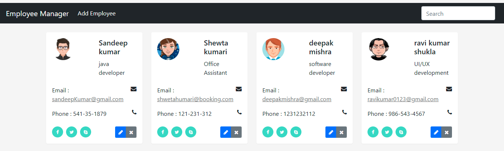

# EmployeeManagerApp

This project was created with :
####Angular version 11.2.6
####springboot version 2.4.4 on openjdk11
####MySQL

###Ports

`java=8090`
`angular=4200`
`DataBaseName = employeemanagerdb`

####Skipping the tests
ng generate service employee --skip-tests=true

###Card Snippits
https://www.bootdey.com/snippets/view/bs4-contact-cards

###Dashboard
